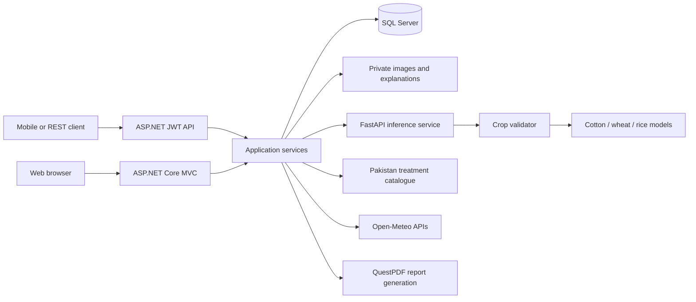

# AgroVisionAI

### AI-assisted crop diagnosis and care guidance for cotton, wheat and rice

AgroVisionAI is a final-year project that helps users inspect crop leaf photographs, identify a supported crop, and view a suspected disease with practical care guidance. It combines an ASP.NET Core web application with a Python inference service, keeping each user's results, images and feedback connected to their account.

A user uploads a leaf image, the AI identifies the crop, and the appropriate disease model analyzes it. The application then presents the result, confidence, supporting information and Pakistan-focused crop-care guidance. Users can revisit their history, download a PDF report and submit feedback; administrators can review that feedback and manage available disease models.

> This is an agricultural decision-support and research application. A model prediction is not a laboratory diagnosis. Confidence does not measure disease severity, and a weather-risk score does not confirm an infection.

## Contents

- [Features](#features)
- [Supported crops and conditions](#supported-crops-and-conditions)
- [How an analysis works](#how-an-analysis-works)
- [Architecture and technology](#architecture-and-technology)
- [User roles](#user-roles)
- [Repository structure](#repository-structure)
- [Local installation](#local-installation)
- [Configuration](#configuration)
- [Using the application](#using-the-application)
- [API reference](#api-reference)
- [Docker setup](#docker-setup)
- [Tests and continuous integration](#tests-and-continuous-integration)
- [Data storage and GitHub policy](#data-storage-and-github-policy)
- [Troubleshooting](#troubleshooting)
- [Limitations and future work](#limitations-and-future-work)
- [Contributing and licensing](#contributing-and-licensing)
- [Further documentation](#further-documentation)

## Features

| Module | What it does |
| --- | --- |
| Accounts and dashboard | Registration, sign-in, profile management and a personal overview of saved analyses. |
| Automatic crop identification | Routes supported cotton, wheat and rice photographs to their disease model; rejects out-of-scope or insufficiently confident crop predictions. |
| Disease analysis | Displays the suspected condition, confidence, alternative prediction and available model/request metadata. |
| Explanation image | Shows a Grad-CAM attention visualization when the model can produce one. |
| Crop-care guidance | Provides condition information, immediate care, prevention, evidence links and conditional chemical options using the Pakistan treatment catalogue. The care interface supports English and Roman Urdu. |
| History and PDF reports | Keeps previous results and exports a diagnostic/care report with available images, audit metadata and review information. |
| User feedback | Lets users mark a result correct, incorrect or uncertain and provide a suggested condition or comment. |
| Expert review | Gives administrators a feedback queue, review decisions, notes and an export of verified records. |
| AI analytics | Summarizes analysis activity, confidence, processing time and feedback. Regular users see their own data; administrators see platform-wide data. |
| Weather disease risk | Uses Open-Meteo weather data and crop-specific rules to provide risk indicators and scouting advice. |
| Model registry | Lets administrators inspect disease-model candidates, maintain metadata, activate an available model and archive registry entries. |
| Mobile REST API | Exposes authentication, analysis, history, feedback, protected images, PDF reports and weather risk for a future mobile or other API client. |
| Responsive navigation | Uses compact dropdowns and a collapsed navigation menu on smaller screens. |

## Supported crops and conditions

The disease models currently use the following class sets. Healthy is a classification outcome, not a disease.

| Crop | Supported outcomes |
| --- | --- |
| Cotton | Bacterial blight, leaf curl virus, healthy |
| Wheat | Brown rust, yellow rust, healthy |
| Rice | Bacterial leaf blight, brown spot, leaf blast, tungro, healthy |

This gives **11 crop-specific outcomes** across the three disease models. Other crops and diseases are not currently supported by this classification pipeline. A supported crop with an unseen disease can still be misclassified into an existing class.

### Required model files

Place these files in `AgroVisionAI/AIService/models/`:

| Purpose | Preferred filename |
| --- | --- |
| Automatic crop identification | `crop_validator_v2_best.keras` |
| Crop-validator configuration | `crop_validator_v2_config.json` — included in Git |
| Cotton disease classification | `cotton_cnn_v3_best.keras` |
| Wheat disease classification | `wheat_v2_efficientnetv2b0_best.keras` |
| Rice disease classification | `rice_v2_efficientnetv2b0_best.keras` |

**Four trained model binaries are needed for the full pipeline**, including the crop validator. They are distributed separately and are intentionally excluded from Git; cloning the repository does not download them. Obtain the matching trained files from the project maintainer. A public model download location is not configured in this repository.

The crop-validator configuration describes a MobileNetV3Small-based model with four outputs: cotton, wheat, rice and out-of-scope. Preserve its saved class order and preprocessing configuration. Disease-model alternatives and environment overrides are defined in [config.py](AgroVisionAI/AIService/app/config.py); their class order must match training.

The supplied crop-router threshold is provisional. Metrics recorded in its configuration describe that model's recorded evaluation, not the accuracy of the complete application in arbitrary field conditions.

## How an analysis works

1. The user signs in and uploads a JPG, JPEG or PNG leaf photograph.
2. The application validates the upload. The standard limit is **5 MB**, and images must be at least **32 × 32 pixels**.
3. The web application sends the image to the FastAPI service.
4. The crop validator checks whether the image belongs to a supported crop and whether its confidence clears the configured threshold.
5. The selected crop's disease model produces class probabilities and prediction metadata.
6. When available, the service also produces a Grad-CAM explanation image.
7. The application stores the result and private image files, then evaluates the treatment catalogue using the prediction and any supplied field context.
8. The user reads the result, downloads a report or provides feedback. Administrators can subsequently review that feedback.

Treatment guidance considers prediction quality and field context such as days to harvest and assessed whitefly treatment need. It may withhold chemical guidance when the required conditions are not met.

## Architecture and technology



| Layer | Technology used in this repository |
| --- | --- |
| Web/backend | C#, ASP.NET Core MVC targeting .NET 9, Razor views |
| Authentication | ASP.NET Core Identity cookies for MVC; JWT Bearer authentication for the mobile API |
| Database | SQL Server, Entity Framework Core 9 and versioned migrations |
| Frontend | Bootstrap 5, Bootstrap Icons, CSS and JavaScript |
| Inference API | Python 3.11, FastAPI and Uvicorn |
| Machine learning | TensorFlow 2.21.0 / Keras, NumPy and Pillow |
| PDF export | QuestPDF |
| Weather | Open-Meteo geocoding and forecast services |
| Verification | Python tests, .NET treatment verification and a repository hygiene checker |
| Containers and CI | Docker Compose and GitHub Actions |

Dependency versions and allowed ranges are defined in the `.csproj` and Python requirements files. The REST backend is included; a standalone mobile application is not part of this repository.

## User roles

| Capability | Visitor | Signed-in user | Administrator |
| --- | --- | --- | --- |
| View public information and register | Yes | Yes | Yes |
| Analyze images, view personal history and download reports | No | Yes | Yes |
| Submit feedback and use weather risk | No | Yes | Yes |
| View analytics | No | Personal data | Platform-wide data |
| Review submitted feedback and export verified records | No | No | Yes |
| Manage disease-model registry and activation | No | No | Yes |

Administrators use the same sign-in page. Administrative screens require the `Admin` role; there is no public admin registration option. Normal detection/report routes remain scoped to their owner, with separate authorized review routes for administrators.

## Repository structure

```text
AgroVisionAI.sln
README.md
.env.example
.gitignore
.github/workflows/ci.yml
scripts/
  check_repository.py            # Candidate/staged-file hygiene checks
  test_repository_check.py       # Checker regression tests
Verification/                    # .NET treatment-engine verification
AgroVisionAI/
  AgroVisionAI.csproj
  Program.cs                     # Services, auth, configuration and middleware
  Controllers/                   # MVC controllers
    Api/                         # Mobile REST endpoints
  Models/                        # Entities, view models and API contracts
  Data/                          # EF context and Identity role/admin seeding
  Migrations/                    # Database schema evolution
  Services/                      # AI client, weather, risk, JWT and PDF services
  TreatmentPk/                   # Treatment evaluation engine
  ViewComponents/
  Views/                         # Razor screens and shared navigation
  wwwroot/                       # Public styles, scripts, images and libraries
  App_Data/
    TreatmentPk/                 # Versioned catalogue and treatment settings
    CropImages/                  # Private runtime uploads; ignored
    Explainability/              # Private runtime heatmaps; ignored
  AIService/
    app/                         # FastAPI, crop gate and disease-model registry
    models/                      # Versioned metadata; ignored model binaries
    tests/
    requirements.txt
    requirements-dev.txt
    setup_api.bat
    start_api.bat
    run_local.py
  appsettings.json               # Public application defaults
  appsettings.Development.json   # Public development defaults
  appsettings.Local.example.json
  appsettings.Local.json         # Workstation settings; ignored, not published
  Dockerfile
docker-compose.yml
```

## Local installation

The following commands assume Windows PowerShell and start from the repository root unless noted otherwise.

### 1. Prerequisites and checkout

Install a .NET 9 SDK, Python 3.11 with the Windows `py` launcher, and SQL Server or LocalDB. Visual Studio with ASP.NET development tools is optional but provides the Package Manager Console workflow used below. Python dependencies and trained models require additional disk space; model loading can make the first analysis slower.

Clone your repository URL, open its folder, and check:

```powershell
dotnet --version
py -3.11 --version
```

### 2. Create private local configuration

Copy the example without overwriting an existing configuration:

```powershell
if (-not (Test-Path AgroVisionAI/appsettings.Local.json)) {
    Copy-Item AgroVisionAI/appsettings.Local.example.json AgroVisionAI/appsettings.Local.json
}
```

Edit `AgroVisionAI/appsettings.Local.json`:

- Set `ConnectionStrings:DefaultSQLConnection` to your SQL Server instance. The example uses Windows-integrated LocalDB authentication.
- Set `Jwt:Key` to a random secret of at least 32 characters. It is required at web startup, including when using only MVC pages.
- Set `AgroVisionApi:AdminKey` to a separate random secret for model-management calls. FastAPI requires at least 16 characters for this feature; use a longer random value.

Run this command separately for each secret, then paste each output into the relevant local setting:

```powershell
$bytes = New-Object byte[] 48
$rng = [Security.Cryptography.RandomNumberGenerator]::Create()
$rng.GetBytes($bytes)
[Convert]::ToBase64String($bytes)
$rng.Dispose()
```

Keep these values in the ignored local file. The committed configuration intentionally contains empty secrets.

### 3. Restore the web app and create the database

```powershell
dotnet restore AgroVisionAI/AgroVisionAI.csproj
dotnet build AgroVisionAI/AgroVisionAI.csproj --no-restore
```

In Visual Studio, open `AgroVisionAI.sln`, select `AgroVisionAI` as the startup project, and open **Tools → NuGet Package Manager → Package Manager Console**. Select `AgroVisionAI` as the default project and run:

```powershell
$env:ASPNETCORE_ENVIRONMENT = "Development"
Update-Database
```

If you already have a compatible EF Core 9 CLI tool installed, the terminal equivalent is:

```powershell
$env:ASPNETCORE_ENVIRONMENT = "Development"
dotnet ef database update --project AgroVisionAI/AgroVisionAI.csproj --startup-project AgroVisionAI/AgroVisionAI.csproj
```

Development startup does not apply migrations by default. Apply the versioned migrations before using account and diagnosis features. A fresh database does not include previous users or their analysis history.

### 4. Optional administrator setup

In the local configuration, supply your chosen `IdentitySeed:Email`, `IdentitySeed:FullName` and `IdentitySeed:Password`, then temporarily enable `IdentitySeed:Enabled`.

Start the web application once after migrations are applied, confirm the account exists, and disable seeding again. Existing accounts are not assigned a new password by seeding. Do not use a shared default administrator password or commit these settings.

### 5. Install Python dependencies and supply models

Run:

```powershell
.\AgroVisionAI\AIService\setup_api.bat
```

This creates `AIService/.venv` and installs the inference dependencies. Alternatively:

```powershell
Set-Location AgroVisionAI/AIService
py -3.11 -m venv .venv
.\.venv\Scripts\python.exe -m pip install -r requirements.txt
Set-Location ../..
```

Place all four model binaries from the [required model table](#required-model-files) in `AIService/models/`. Keep the crop-validator JSON alongside its matching model.

### 6. Start both services

In one terminal:

```powershell
.\AgroVisionAI\AIService\start_api.bat
```

The launcher checks the disease models and starts FastAPI. Confirm **all four model entries** are loaded through the AI health endpoint, including `crop_validator`; the startup script's disease-model check alone does not verify the crop gate.

In a second terminal:

```powershell
dotnet run --project AgroVisionAI/AgroVisionAI.csproj --launch-profile http
```

| Local service | Address |
| --- | --- |
| Web application | http://localhost:5100 |
| Optional HTTPS launch profile | https://localhost:7091 |
| Web liveness | http://localhost:5100/health |
| AI health and model readiness | http://127.0.0.1:8000/health |
| FastAPI interactive documentation | http://127.0.0.1:8000/docs |

The web `/health` endpoint is a liveness check, not proof that SQL Server and every model are ready. The AI health response distinguishes `ready` and `degraded` states.

## Configuration

| Setting | Purpose |
| --- | --- |
| `ConnectionStrings:DefaultSQLConnection` | SQL Server connection string |
| `AgroVisionApi:BaseUrl` | Web-to-FastAPI URL; local default is `http://127.0.0.1:8000/` |
| `AgroVisionApi:AdminKey` | Shared secret for FastAPI model management |
| `Jwt:Key` | API token signing secret |
| `Jwt:Issuer`, `Jwt:Audience` | Expected JWT issuer and audience |
| `Jwt:AccessTokenMinutes` | Access-token lifetime; default 60 minutes |
| `IdentitySeed:*` | Optional administrator initialization |
| `Database:ApplyMigrationsOnStartup` | Opt-in startup migrations; enabled in the supplied Compose configuration |
| `WeatherApi:GeocodingBaseUrl`, `WeatherApi:ForecastBaseUrl` | External weather service URLs |

`appsettings.Local.json` loads only in **Development** and is excluded from Git, publishing and Docker build contexts. Environment variables and command-line arguments override it. Environment-variable forms use double underscores, for example `Jwt__Key` and `ConnectionStrings__DefaultSQLConnection`.

FastAPI uses its own environment variables:

| Variable | Purpose |
| --- | --- |
| `AGROVISION_ADMIN_KEY` | Shared model-management secret; must match the web setting |
| `AGROVISION_MODELS_DIR` | Model directory override |
| `AGROVISION_MODEL_SELECTION_FILE` | Location of persisted active disease-model selection |
| `AGROVISION_COTTON_MODEL`, `AGROVISION_WHEAT_MODEL`, `AGROVISION_RICE_MODEL` | Explicit disease-model path overrides |

`start_api.bat` calls `run_local.py`, which reads the shared admin key from the web application's ignored local file unless `AGROVISION_ADMIN_KEY` is already set. Direct Uvicorn and Docker startup use environment variables instead. Docker Compose reads the root `.env`; `dotnet run` does not load it automatically.

## Using the application

1. Register an account or sign in.
2. Open **Scan Crop** and upload one clear, well-lit supported crop leaf image.
3. Read the crop identification, suspected condition and confidence. If the crop is rejected or uncertain, take a clearer photograph and try again.
4. Inspect the care guidance and, when available, the attention image. Add relevant field context before relying on conditional chemical options.
5. Download a diagnostic PDF or open **History** from the account menu to revisit results.
6. Submit feedback if the prediction appears correct, incorrect or uncertain.
7. Use **Tools → Weather Risk** or **Tools → AI Analytics** for the additional modules.

Administrators also have **Tools → Expert Review** and **Tools → Model Registry**. Activating a model requires a compatible file already available to the AI service. Feedback collection and model activation do not automatically retrain a model.

## API reference

### Application API

MVC pages use Identity cookies. Protected mobile endpoints use `Authorization: Bearer <access-token>`. Obtain a token from register/login; those routes accept JSON account details.

| Method | Route | Purpose |
| --- | --- | --- |
| POST | `/api/mobile/auth/register` | Register and obtain an access token |
| POST | `/api/mobile/auth/login` | Sign in and obtain an access token |
| GET | `/api/mobile/account/me` | Current user profile |
| POST | `/api/mobile/detections/analyze` | Analyze multipart field `cropImage` |
| GET | `/api/mobile/detections` | Paginated personal history |
| GET | `/api/mobile/detections/{id}` | Personal detection details |
| POST | `/api/mobile/detections/{id}/feedback` | Submit/update feedback |
| GET | `/api/mobile/detections/{id}/image` | Protected uploaded image |
| GET | `/api/mobile/detections/{id}/explanation` | Available explanation image |
| GET | `/api/mobile/detections/{id}/report.pdf` | Diagnostic PDF |
| GET | `/api/mobile/weather-risk` | Weather-risk assessment |

See [Mobile API documentation](AgroVisionAI/MOBILE_API_README.md) and the controller contracts for request fields and query parameters. Refresh-token rotation is not implemented.

### Inference service

| Method | Route | Purpose |
| --- | --- | --- |
| GET | `/health` | Service and model readiness |
| GET | `/api/v1/models` | Crop-validator and disease-model status |
| POST | `/api/v1/predict` | Automatic prediction using multipart field `file` |
| POST | `/api/v1/predict/{crop}` | Prediction with an explicit crop that must agree with the crop validator |
| GET | `/api/v1/admin/models` | Inspect managed disease-model files |
| POST | `/api/v1/admin/models/{crop}/activate` | Activate an available disease-model file |

The two admin routes require `X-AgroVision-Admin-Key`. The inference service's ordinary routes do not use the application's JWT authentication; place the service on an appropriate private network when deploying. Use the application API for authenticated user workflows and saved history.

## Docker setup

The Compose stack starts three services: the web application, FastAPI and SQL Server.

1. Install Docker with Linux container support.
2. Supply the four trained model binaries in the model directory.
3. Copy `.env.example` to `.env` without overwriting existing deployment settings.
4. Fill the blank `SQL_SA_PASSWORD`, `JWT_KEY` and `AI_ADMIN_KEY` values. Configure admin email/password only if enabling `ADMIN_SEED_ENABLED`.
5. Start the stack:

```powershell
docker compose up --build
```

The default web address is http://localhost:8080. Host ports can be changed through `.env`. Model files are mounted read-only; SQL data, uploaded images, explanations and active-model selection use persistent volumes. Compose enables automatic database migrations.

Stop containers while preserving their volumes:

```powershell
docker compose down
```

See [Docker and CI setup](AgroVisionAI/DOCKER_CI_README.md) for details. The supplied stack is a local/development starting point, not a complete hardened production deployment. Review HTTPS, exposed ports, database edition, secrets and backup/restore procedures before deployment. Volume deletion removes persisted data.

## Tests and continuous integration

Run these commands from the repository root:

```powershell
# Compile the web application
dotnet build AgroVisionAI/AgroVisionAI.csproj --no-restore

# Verify treatment evaluation and its guard conditions
dotnet run --project Verification/TreatmentPk.Tests.csproj

# Check repository candidates and the checker itself
py -3.11 scripts/check_repository.py
py -3.11 scripts/test_repository_check.py

# Install and run inference-service tests
.\AgroVisionAI\AIService\.venv\Scripts\python.exe -m pip install -r AgroVisionAI/AIService/requirements-dev.txt
Push-Location AgroVisionAI/AIService
.\.venv\Scripts\python.exe -m pytest -q
Pop-Location
```

Python unit tests cover areas such as crop gating, automatic routing, catalogue behavior and model registry management using mocked inference where appropriate. Unit tests are not a substitute for evaluating real model weights against representative field photographs.

[GitHub Actions](.github/workflows/ci.yml) runs on pushes and pull requests to `main`, `master` and `develop`, and can also be triggered manually. It checks repository hygiene, tests the checker, restores/builds/publishes the web app, runs Python tests and validates Docker builds on non-PR runs. It uploads a short-lived web build artifact; it does not deploy the application or publish container images to a registry. Run the .NET treatment verification command separately; it is not currently a CI job.

## Data storage and GitHub policy

SQL Server stores Identity accounts, detections, disease records, prediction feedback and model registry metadata. Uploaded crop images and generated explanation images are private runtime files stored outside `wwwroot`; application endpoints control access. Treatment catalogues are versioned JSON files.

| Commit to GitHub | Keep local or in separate storage |
| --- | --- |
| Source code, views, scripts and styles | Passwords, JWT/API keys and certificates |
| Project files, requirements and migrations | `.env`, `appsettings.Local.json` and private overrides |
| Tests, workflows, Dockerfiles and documentation | `bin`, `obj`, `.vs`, `.venv`, caches and logs |
| Public defaults and empty-secret examples | Databases, backups, user uploads, heatmaps and exports |
| Treatment catalogue, class labels and model configuration | Trained model binaries and private datasets |
| Public website images and frontend libraries with their licences | Local task summaries and generated validation reports |

Do not ignore all `App_Data` or `wwwroot`: the treatment catalogue and public website assets are required. Frontend libraries remain versioned because the project does not currently restore them through a frontend package manager.

### Before committing or pushing

```powershell
py -3.11 scripts/check_repository.py
git status --short
git diff --stat
git add .
py -3.11 scripts/check_repository.py --staged
git diff --cached --stat
```

Review the staged diff locally, run the relevant tests, then commit with a descriptive message and push to your intended branch. The staged checker reads the exact Git index, so a working-copy edit does not sanitize an already-staged secret until that file is staged again.

The checker rejects known private/runtime paths, tracked ignored files, model binaries, files over the repository's 50 MiB limit, populated configuration secrets and selected credential signatures. It is a focused safeguard, not an exhaustive secret scanner or a Git history audit. Do not force-add private files.

**History note:** uploaded crop images existed in earlier commits. Removing their tracking does not erase those commits. If those images must remain private, clean the history or prepare a clean repository before publishing it. Rotate any credential that has actually been exposed. Back up the database, private images and trained models separately from Git.

## Troubleshooting

| Problem | Check |
| --- | --- |
| Web startup says `Jwt:Key` is missing | Set a random key in the ignored local file and run with the Development launch profile, or supply `Jwt__Key`. |
| SQL connection fails or a table is missing | Confirm the SQL instance, connection string and permissions; apply the project's EF migrations. |
| AI service is unavailable | Start FastAPI, check its `/health` response and confirm `AgroVisionApi:BaseUrl`. |
| Crop validator is unavailable | Supply `crop_validator_v2_best.keras` and its matching original JSON configuration. Three disease models alone are insufficient. |
| A disease model is not ready | Check filenames, class order, TensorFlow compatibility and the model status error. |
| Image is rejected | Use a valid JPG/PNG under 5 MB, at least 32 × 32 pixels, showing one clear supported leaf. |
| Model management returns 401 or 503 | Ensure the web admin key matches FastAPI's key; an unset or too-short key disables model management. |
| Admin links are missing | Confirm that the signed-in account has the `Admin` role and sign in again after role changes. |
| Weather information is unavailable | Check network access to the configured Open-Meteo services and the requested location. |
| First analysis takes longer | TensorFlow/model loading can delay startup or the first request; inspect the service log and readiness. |
| Python environment refers to an old machine | Recreate the local virtual environment using your installed Python 3.11 and reinstall requirements; do not copy `.venv` between machines. |
| Updated styling is not visible | Restart the app if needed and perform a browser hard refresh. |

## Limitations and future work

### Current limitations

- The disease classifiers cover only the listed crops and outcomes. Image quality, unfamiliar conditions and differences from training data can affect results.
- A Grad-CAM image highlights model attention; it does not measure infected area or disease severity, and may be unavailable for a model.
- Weather assessments are rule-based risk indicators, not a trained forecast of confirmed field infection.
- Care guidance depends on the stored catalogue, prediction quality and available field context. Confirm consequential treatment decisions with qualified local advice and the current product label.
- This repository does not provide a reproducible end-to-end training pipeline or the full training datasets. Model files must be supplied separately.
- The application includes a mobile API, not a completed mobile client. Feedback does not trigger automatic retraining.
- No single verified field-accuracy figure is claimed for the complete application.

### Potential future work — not implemented commitments

- Broader field validation, documented dataset provenance and per-model evaluation reports.
- More crops/classes after collecting appropriate training and validation data.
- A mobile client and a reviewed offline workflow.
- A versioned model release process with checksums, reproducible training and controlled rollback.
- Refresh tokens, additional account controls and deployment monitoring.
- Automated integration tests for authenticated analysis, reports and administrator workflows.

## Contributing and licensing

Keep changes focused, add or update tests when behavior changes, and update documentation when routes, configuration or model requirements change. Do not include user data, secrets or model binaries in a pull request. Document changes to model class order and treatment-catalogue semantics explicitly.

A project-level licence file has not been supplied in this repository. Confirm permission with the maintainer before redistribution or use beyond the intended project context. Included third-party libraries retain their own licence files. QuestPDF is configured with its Community licence setting in the application; verify eligibility for your intended use. Model and dataset permissions should be documented separately by their provider.

## Further documentation

- [AI service setup](AgroVisionAI/AIService/README.md)
- [Model filenames and class order](AgroVisionAI/AIService/models/README.md)
- [API startup guide](AgroVisionAI/API_SETUP.md)
- [Mobile API](AgroVisionAI/MOBILE_API_README.md)
- [Docker and CI](AgroVisionAI/DOCKER_CI_README.md)
- [Treatment module guide](START_HERE_TREATMENT.md)
- [Repository checker](scripts/check_repository.py)

The source code, configuration files and migrations are the reference for current behavior. Some older task-specific notes describe earlier snapshots; use this README for fresh-clone setup.
